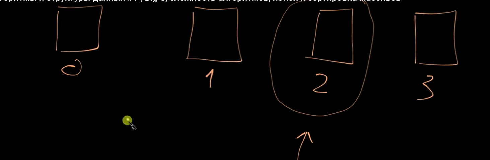
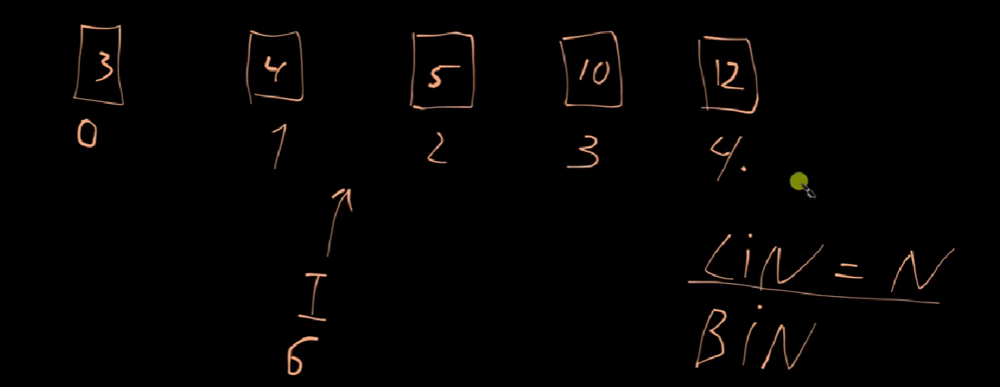
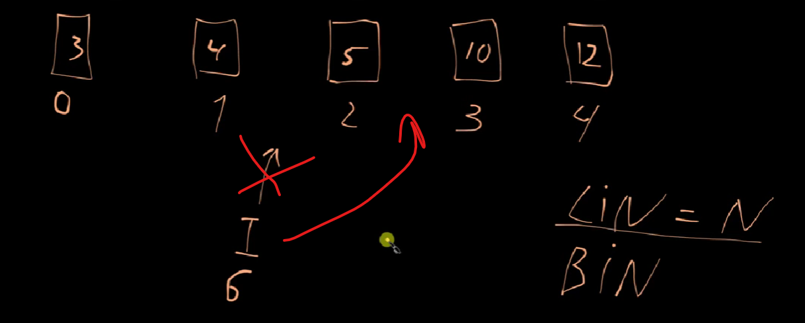
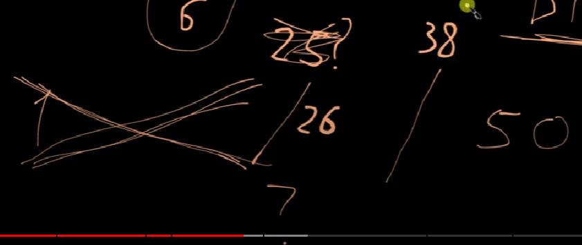
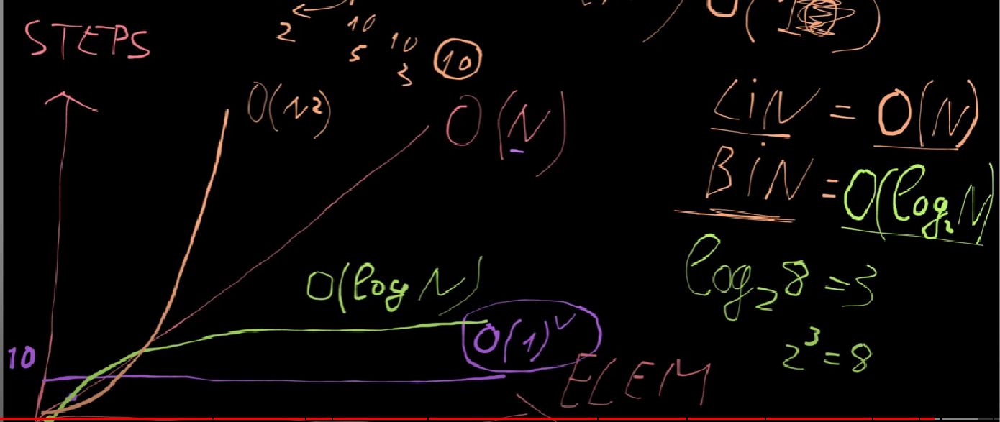

## 1 Big O, сложность алгоритмов, поиск и сортировка массивов/сетов
https://www.youtube.com/watch?v=BlwiPA9rx8w&list=PLWlFXymvoaJ-Q8FyOj9SQ3Eoog5Nkv0lI  
Оптимальность алгоритмов сортировки и поиска обычно оценивается с помощью нотации Big O,
т.е. ***<u>описывает как изменяется время выполнения алгоритма (или использование памяти)
в зависимости от размера входных данных 𝑛</u>***
 
O(1) означает, что операция выполняется за фиксированное время, независимо от количества данных.  
O(n) означает, что время выполнения операции зависит от размера данных, где n — общее количество элементов.

- данные по разному устроены/организованы(ИХ СТРУКТУРА) и в зависимости от этого:
- к задаче можно подойти по разному и разными спобами ее решить(ИХ АЛГОРИТМЫ)... а мы ж хотим хотим что это было все быстро!

### Что мы можем делать с данными?не так много, но мы можем их:
- (READ)ЧИТАТЬ:
-- в массиве какое-то значения
-- в строке какою-то конкрутную букву ПО ИНДЕКСУ
- (INSERT)СОЗДАВАТЬ или что-то добавлять: в массив,  строку и т.д.
- (SEARCH)ПОИСК: потребуется понять на какой позиции находится то или иное значение
- (DELETE)удалить значение из нашей структуры
#WARN: В РАЗНЫХ СТРУКТУРАХ ЭТИ ОПЕРАЦИИ БУДУТ РЕАЛИЗОВАНЫ ПО РАЗНОМУ

### Ответ: Поэтмоу нам нужно знать/понять:
- какие бывают  структуры
- на сколько в разных структурах эти ОПЕРАЦИИ БЫСТРЫЕ/оптимальные(не время, а сколько шагов требуется)

---
### Вопрос_1(массив и 4 действия),

#### 1. <u>(READ-R)</u> Я хочу прочитать **С МАССИВА** значение под индексом 2(третий коробочки), то сколько шагов мне на это потребуется?  
- т.к. мы **НЕ** открываем все коробки последовательно, 
- и на них написано номер(по очереди) прям на самих коробков, то даже **НЕ НАДО считать**    
#### <u>**Овтет:**</u> 
- R = 1 (шагов)
- Мы берем и достаем ПО ИНДЕКСУ наше коробку, поэтому это всего ОДНА ОПЕРАЦИЯ/шаг **для массива**.
- при том, **НЕВАЖНО СКОЛЬКО ЕЛЕМЕНТОВ В МАССИВЕ** - все равно будет один шаг  
-- потому что в массиве указывается начало массива(его индекс), поэтмому за один шаг можно достать нужный елемент считая от  самого начала.
#### 2. <u>(SEARCH-S)</u>  Поиск значения, а не индекса... 
- только перебором коробочек от начала и до конца..
  - при самом ПЛОХОМ вариенте нужное значение может оказаться в самой ПОСЛЕДНЕЙ коробочки..
  - это значит что ***потенциально*** нам потребуется сделать столько же шагов, сколько в массиве
#### <u>**Овтет:**</u> 
- S = N (шагов), потенциальных(потмоу что говорим об worste case scenerio)
- где, N - кол-во елементов в массиве
- данный поиск называется ***ЛИНЕЙНЫМ*** потому что мы *последовательно* открываем каждую коробку
#### 3. <u>(INSERT-I)</u>   вставка значения (происходит по индексу)
3.1. вставка елемента в конец:
- ~~**I = 1** (шагов)~~  - но это не worste case scenerio

3.2. вставка елемента в середину:  

- появляется новая каробочка
- всех коробчки что справа - нужно сдвинуть ПО ИНДЕКСУ
- worste case scenerio: 
  - <u>***I = N + 1 (шагов)***</u>
  - вставка в начало, т.е. сдвинуть все кол-во елементов N
  - плюс один шаг на саму вставку елемента
#### 4. <u>((DELETION-D)</u>  Удаление коробки  (по индексу):
тоже самое что и INSERT, только в другую сторону
- ~~**I = 1** (шагов)~~  - но это НЕ worste case scenerio
- worste case scenerio:
  - <u>***D = 1 + (N - 1) = N (шагов)***</u>
  - + 1 (шаг, т.к. удаление)
  - N - 1 (т.к. екдментов стало на один меньше)
---------
### Вопрос_2(набор или SET и 4 действия),  
SET гарантирует уникальность елементов (значение в коробке уникальное)
#### 1. <u>(READ-R)</u> сеты похожы на масивы и с чтением - тоже самое
<u>**Овтет:**</u>  ***R = 1 (шагов)***
#### 2. <u>(SEARCH-S)</u>  Поиск значения, а не индекса... 
Такакя же история как и МАССИОВОМ..да мы знаем что там нет дублирующихся елементов,  
НО если наше значение находится в посденей коробке, то...
#### <u>**Овтет:**</u>   <u>***S = N (шагов)***</u>  , потенциальных(потмоу что говорим об worste case scenerio)
#### 3. <u>(INSERT-I)</u>   вставка значения (происходит по индексу)
Т.к. СЕТ гарантирует уникльность значений, то прежде нужно понять:
- нету ли там токого ж ЗНАЧЕНИЯ елемента... потому что мы не можем хранить дубликаты
- т.е. нужно проерить..а это сдлеать поиск (S = N)
- плюс вставку без поиска по worste case scenerio (I = N + 1)
#### <u>**Овтет:**</u>   <u>***I = 2N + 1(шагов)*** Как результат, минус - сет в 2 раза медленее, НО плюс - гаранитрует уникальность данных.
#### 4. <u>(DELETION-D)</u>: проверку на уникальность не нужно делать, т.к. удаление
#### <u>**Овтет:**</u>   ***D = N (шагов)***</u>, т.к. D = 1 + (N - 1)

----
### Линейний поиск(lin = N) VS Бинарный поиск (O(logN))
 Бинарный поиск 
- умеет работать ТОЛЬКО С ОТСОРТИРОВАННЫМИ МАСИВАМИ(значения по порядку).
  - Остортировать можно массив ТОЛЬКО С ОДНОРОДНЫМИ типами ДАННЫХ. 
  - с обычным масиов НЕ РАБОТАЕТ,т.к. он не отсортирован..
- если в него добавляется(INSERT) новый елемент, то он  добавляется на правильное место.  
  - Т.е. выполнить поиск  O(logN)
  - потом давить (+1)
  - остальных ребят сдвинуть O(N)

~~I = 2N + 2~~ = O(logN) (поиск)+O(N) (сдвиг элементов)+O(1) (вставка)=O(N)
#### Kак работает бинарный поиск?
Бинарный поиск последовательно делит отсортированный массив пополам, сравнивая искомое значение с центральным элементом, сравнивая его значение с цетральным елементов, пока не найдет нужное значение.

---------------
График:
- Х: кол-во шагов(steps), которое нужно сделать в том или другом алгоритме (O)
- Y: кол-во елементов в наборе данных (N)

1) lin = O(N) : колво шагов == кол-ву елментов (worste case)
2) O(1): неважно сколько елментов, НО кол-во шагов всегда будет постоянно(и маленькое, хоть 10 или 1, но записывается как константа O(1))
3) bin = O(log𝑛 N):
   -  log: это способ понять, сколько раз нужно поделить или уменьшить число, чтобы получить какое-то
   определенное значение. Например(log_2 8 = 3):
      - Если у тебя 8 игрушек, и ты делишь их пополам:
         - Сначала будет 4 игрушки,
         - Потом 2 игрушки,
         - И в конце останется 1 игрушка.
      - Значит, ты поделил 3 раза, и логарифм от 8 по основанию 2 будет 3.
      - log_3 27=3: Мы делим 27 на 3 три раза, чтобы получить 1.

