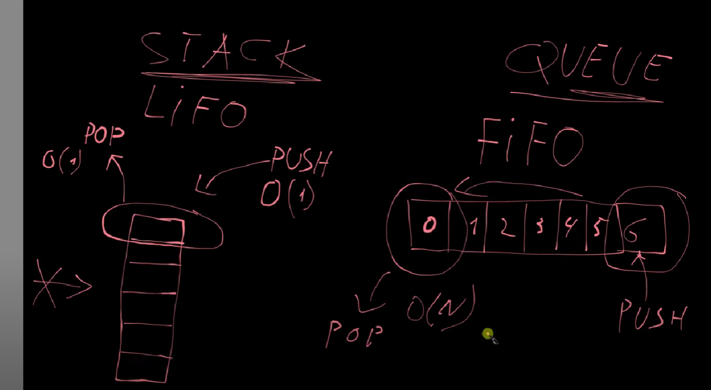

| Характеристика                     | Stack (Стек)                                                                                                                                                                                                                                        | Queue (Очередь)                                                                                                                                                                                                                    |
|------------------------------------|-----------------------------------------------------------------------------------------------------------------------------------------------------------------------------------------------------------------------------------------------------|------------------------------------------------------------------------------------------------------------------------------------------------------------------------------------------------------------------------------------|
| **Принцип работы**     | **LIFO**: Последний вошел, первый вышел                                                                                                                                                                                                             | **FIFO**: Первый вошел, первый вышел                                                                                                                                                                                               |
| **Преимущества**       | **Быстрая вставка и удаление** на одном конце (*O(1)*)                                                                                                                                                                                              | **Легко моделировать реальную очередь**, поддержка процессов по порядку                                                                                                                                                            |
| **Недостатки**         | **- Доступ только к верхнему элементу**,  - нельзя получить доступ к элементам в середине                                          | **Операции работают на разных концах**: -  вставка <U>(enqueue/push)</u> **ТОЛЬКО** в конец, -  удаление <U>(dequeue/pop)</u> **ТОЛЬКО** с начала                                                                          |
| **Основные операции**              | - `push` (добавить элемент): **O(1)**,  - `pop` (удалить элемент): **O(1)**,  - `peek` (посмотреть верхний элемент): **O(1)**                                                                                                               | - `enqueue` (добавить элемент в очередь): **O(1)**,  - `dequeue` (удалить элемент из очереди):  -- **O(1)** (если связный список)   -- или **O(n)** (если массив),  - `peek` (посмотреть первый элемент): **O(1)** |
| **Типичные применения**| Рекурсия, отмена действий (**Ctrl + Z**)                                                                                                                                                                                                            | Очереди задач, управление процессами                                                                                                                                                                                               |
| **Специфические характеристики**   | Доступ только к верхнему элементу                                                                                                                                                                                                                   | Доступ только к первому и последнему элементам                                                                                                                                                                                     |
