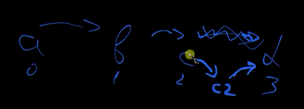

| Характеристика                     | Linked List (Односвязный список)                                                                                                                                                                                                                   |
|------------------------------------|----------------------------------------------------------------------------------------------------------------------------------------------------------------------------------------------------------------------------------------------------|
| **Принцип работы**                 | **Последовательное соединение узлов**:   - Каждый элемент (узел) содержит данные и указатель на следующий узел  - похожий на блокчейн, но в другую сторону (ссылка идет на следующий элемент, а не на предыдущий).                         |
| **Преимущества**                   | - **Гибкость в изменении размера**: легкое увеличение и уменьшение списка (*O(1)* добавление/удаление в начале списка)   - Нет необходимости выделения непрерывного блока памяти                                                               |
| **Недостатки**                     | - **Медленный доступ по индексу**: необходимо пройти весь список от начала до нужного элемента (*O(n)*)   - **Потери памяти на указатели**: каждый узел требует дополнительной памяти для хранения указателя на следующий узел                 |
| **Основные операции**              | - `append` (добавить элемент в конец): **O(n)** (если нет указателя на конец списка)   - `prepend` (добавить элемент в начало): **O(1)**   - `insert` (вставить элемент по индексу): **O(n)**   - `delete` (удалить элемент): **O(n)** |
| **Типичные применения**            | Реализация очередей, стеков, списков (например, управление задачами или история браузера)                                                                                                                                                          |
| **Специфические характеристики**   | - Доступ возможен только последовательным обходом списка   - Возможность реализации как **односвязного**, так и **двусвязного** списка (где каждый узел хранит ссылки на следующий и предыдущий узлы)                                          |

| Характеристика/Операция  | Массив (Array)                                                                                                              | Linked List (Односвязный список)                                                                                                                                                                                                               |
|--------------------------|-----------------------------------------------------------------------------------------------------------------------------|------------------------------------------------------------------------------------------------------------------------------------------------------------------------------------------------------------------------------------------------|
| **Структура**            | Непрерывный блок памяти                                                                                                     | Узлы, связанные указателями                                                                                                                                                                                                                    |
| **Память**               | Эффективное использование памяти                                                                                            | Дополнительная память на указатели      (х2,т.к. надо еще храить линку на СЛЕДующий елемент)                                                                                                                                                   |
| **Read (Чтение)**        | **O(1)**: Доступ по индексу мгновенный – просто прибавляем индекс к началу массива.                                         | **O(n)**: В односвязном списке каждый элемент (узел) хранит ссылку на следующий узел, <u>***НО НЕ НА ПРЕДЫДУЩИЙ***</u>. Чтобы прочитать элемент по индексу, необходимо последовательно переходить от одного узла к другому, что занимает O(n). |
| **Search (Поиск)**       | Линейное (*O(n)*)                                                                                                           | Линейное (*O(n)*)                                                                                                                                                                                                                              |
| **Insert (Вставка)**     | - **Начало**: <u>Медленное (*O(n)*)</u>   - **Середина**: Медленное (*O(n)*)   - **Конец**: <u>Быстрое (*O(1)*)</u> | - **Начало**: <u>Быстрое (*O(1)*)</u>        - **Середина**: Медленное (*O(n)*)   - **Конец**: <u>Медленное (*O(n)*)</u>                                                                                                               |
| **Delete (Удаление)**    | - **Начало**: <u>Медленное (*O(n)*)</u>   - **Середина**: Медленное (*O(n)*)   - **Конец**: <u>Быстрое (*O(1)*)</u> | - **Начало**: <u>Быстрое (*O(1)*)</u>        - **Середина**: Медленное (*O(n)*)   - **Конец**: <u>Медленное (*O(n)*)</u>                                                                                                               |

### В Python нет встроенного Linked List, потому что:

- Списки (list) уже достаточно универсальны и покрывают большинство задач.
- Linked List требует больше памяти из-за указателей, что не всегда оправдано.
- Python ориентирован на простоту и удобство; списки проще в использовании.
- Если нужен Linked List, его легко реализовать самостоятельно.