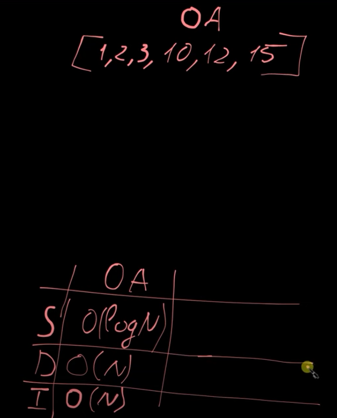
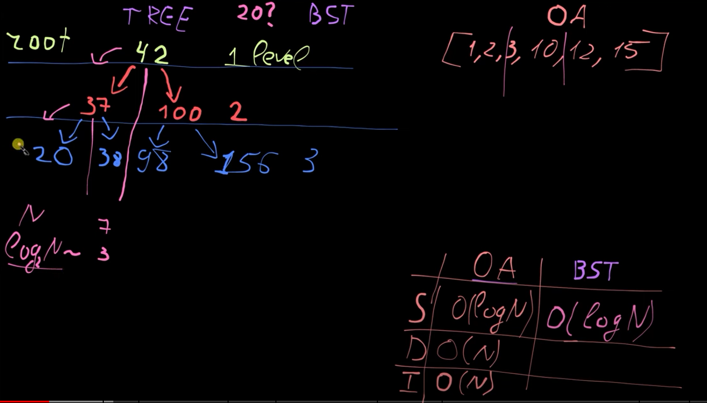
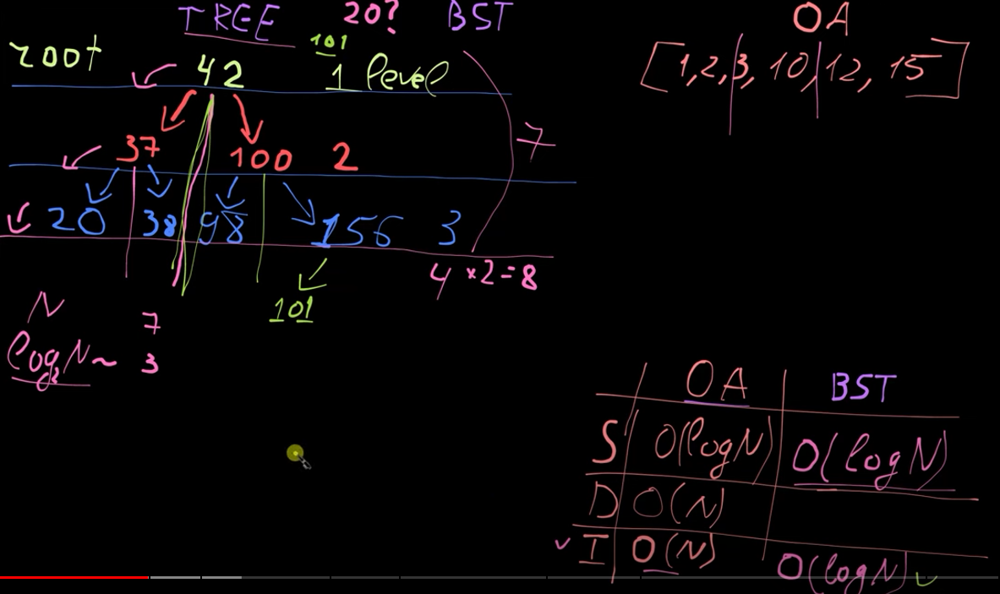
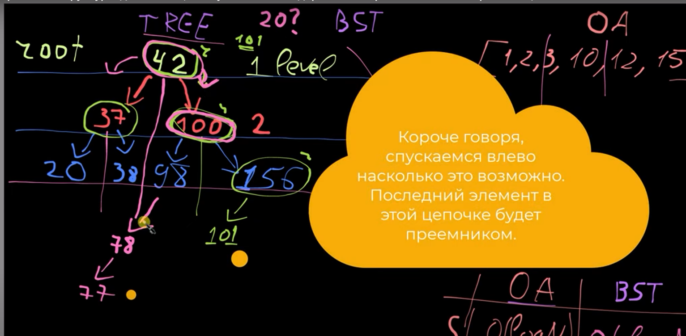
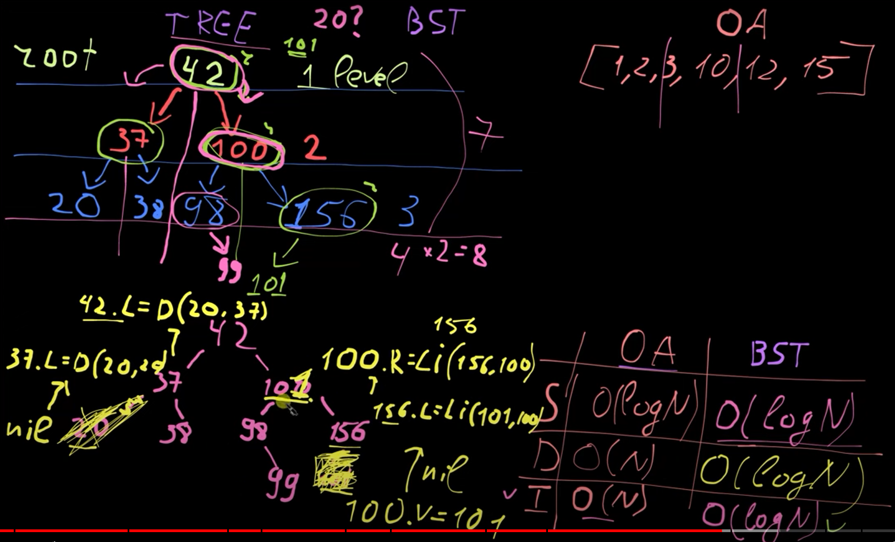

В сортированном массиве: 
 - поиск (ОЧЕНЬ БЫСТРО)
 - вствака (ЗАТРАТНО,т.к. еще свдинуть все елементы нужно)

###  Но это не единственный способ поиска, <u>есть еще binary search trees (BST)</u>.

Бинарный поиск как с МАСИВАМИ(на каждом шаге отсекается половина элементов)  

1.SEARCH - Хотим найти 20, что делать?
- при опускании на 1 лвл вниз - отекаем тогже половину
- log_2(N) ~ 3... <u>(если посчитать, то 7 узлов и 3 уровня, т.е. log_2(7узлов) = 3 шага/лвл</u>
- array  log_2(N)  == BST log_2(N)  - одинковово, <u>***НО***</u>
2. SEARCH - BTC  ПОБЕЖДАЕТ  Хотим ВСТАВИТЬ 101, что делать?
- I: array O(N) = O(logN), т.к. проходимся по дереве вниз

### Почему балансировка важна?  
- Если бинарное дерево поиска не сбалансировано, оно может выродиться в список, и тогда его производительность <u>станет аналогичной линейному поиску</u> с временной сложностью O(n).
- В сбалансированном дереве операции выполняются за время O(log n), что сопоставимо с бинарным поиском на массиве.

3. Deletion - НЕОЧЕВИДНОЕ -  нужно найти примемника 

что-то бы что-то найти, нужно сделать БИНАРНЫЙ поиск O(logN) + ПЕРЕСТРОИТЬ ДЕРЕВО(но константы отбрасываем)  

