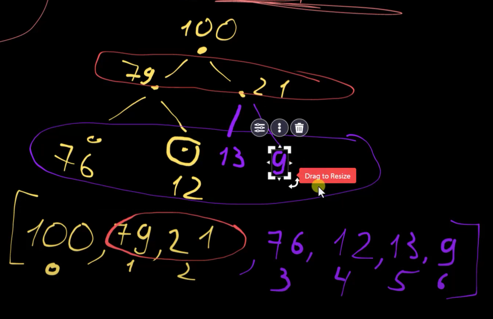

### binary heaps = двоичные кучи = сортирующие деревеья
https://www.youtube.com/watch?v=hOFj2Z6xHuw


| Характеристика                | Двоичная куча (Binary Heap)            | Двоичное дерево поиска (Binary Search Tree) |
|--------------------------------|----------------------------------------|---------------------------------------------|
| **Структура**                  | Почти полное бинарное дерево            | Бинарное дерево с упорядоченными узлами     |
| **Свойство**                   | **Max-Heap:** значение каждого узла >= значений потомков.<br>**Min-Heap:** значение каждого узла <= значений потомков. | Для каждого узла: значения в левом поддереве < значения узла, значения в правом поддереве > значения узла |
| **Используемая структура**     | Обычно представлена в виде массива      | Реализуется через указатели (ссылки на левые и правые дочерние узлы) |
| **Применение**                 | Приоритетные очереди, алгоритмы сортировки (Heapsort) | Хранение и поиск отсортированных данных, базы данных |
| **Вставка**                    | O(log n)                               | O(log n) в среднем, O(n) в худшем случае   |
| **Поиск элемента**             | O(n)                                   | O(log n) в среднем, O(n) в худшем случае   |
| **Удаление элемента**          | O(log n) (удаление корневого элемента, обычно) | O(log n) в среднем, O(n) в худшем случае  |
| **Извлечение максимума/минимума**| O(log n)                              | N/A (не оптимизировано для этой операции)   |
| **Доступ к максимуму/минимуму**| O(1)                                   | N/A                                        |
| **Порядок элементов**          | Не упорядочены для поиска               | Упорядочены для эффективного поиска         |
| **Сбалансированность**         | Всегда сбалансировано (почти полное дерево) | Может быть несбалансированным              |
 
***Полное дерево*** - 
-  это такое бинарное дерево, в котором все уровни, кроме, возможно, последнего, полностью заполнены, а все узлы на последнем уровне располагаются максимально слева.
- <u>Другими словами</u>, 
  - каждый узел на каждом уровне (кроме последнего) имеет ровно два потомка,
  - а на последнем уровне все узлы расположены слева, ***без пропусков***.
  

### Проблема:
- В двоичных деревьях поиска порядок вставки элементов может привести к тому, что дерево будет несбалансированным и не полным, что повлияет на его производительность.

###  Применение:
Очередь **С ПРИОРИТЕТОМ**, в отличии от обычного стека(без приоретоета, т.е. FIFO)  

- т.е. изанчально пустой стек пустой стек
- потом прилетает задача с приоритетом, пусть 5, т.е. елемент (е5)
  - который становится первым (и единственным) в очереди.
- напрмиер прилитает в очредь задача с приоритетом=10, т.е. елемент (е10) 
  - Поскольку у него приоритет выше, чем у , он занимает место перед ним в очереди.
  - Теперь очередь выглядит так: (е10), (е5)
- потом может прилетет вторая задача с высшим приоритом, пусть 6, т.е. елемент (е6) и это означает ...
  - должен занять место в СЕРЕДИНЕ очереди, так как у него  приоритет выше, чем у  (е5), но ниже, чем у (е10)
  - Теперь очередь выглядит так: (е10), (е6), (е5)

### Опеарции:
- ***INSERT***: 
  - Их можно сделать через сортированные массивы, т.е. какждый раз когда мы добавляем елемент,
  его сортировать(ПО ПРИОТЕТНОСТИ), т.е. **O(N)**, ***НО***  
  - binary heap: БЫСТРЕЕ работает **O(log n)** от массива
  - 
  - к примеру, хотим вставить 29,
    - находим пустую ячейку(САМЫЙ ПОСЛЕДНИЙ ЕЛЕМЕНТ)
    - потом сравниваем с родителем, если больше, то меняем пустами
    - и так рекурсивно пока 
      - радитель не будет больше потомка
      - или пока есть последний родитель(корень древа)
- ***Search***:
  - binary heap: обычный поиск - медленее
    - т.к. нужно пройтись вниз по дереву  O(n)   И возможно ПАРУ РАЗ начиная с корня.
    - к примеру найти 9.. в кокой из ветке нахоится оно - НЕЯСНО

  - binary heap: поиск MAX/MIN - быстрее
    - за одну опреацию O(1)
- ***Delete***:
  - ТОЛЬКО КОРЕНЬ ***О(1)***
  - нет опции удалить середину
  - как это делается?
    - 
    - НАХОДИТСЯ последний елемент
      - это наша 11, т.е. ТОТ КТО стоит
        - на САМОМ НИЖНЕМ УРОВНЕ 
        -  + САМЫЙ СПРАВА
      - заменяем его на наш корень который хотим удалить, т.е.
        - 42 удаляется
        - шаим новым корнем становится 11
      - НАРУШАЕТСЯ правило heap (родитель НЕ МЕНЬШЕ чем потомок), поэтому
        - смотрим его 2х потомков 
        - и из этих 2х потомков ***выбираем самого большого***=21
        - пересталяем его с корнем=11
      - потом СНОВА проверяем  правило heap (родитель НЕ МЕНЬШЕ чем потомок), и если
        - потомоки меньше, то ОК
        - нарушается правило, то РЕКУРСИВНО опять меняем его местам
    - НО как компьютеру обьяснить "ГДЕ ПОСЛЕДНИЙ ЕЛЕМЕНТ?" (визуально то видно)
      - для этого используются самые обычные массивы 
        - на первую позицию **ставим корень**, индекс 0. (0 уровень)
        - на вторую/третию позицию ставим **потомков корня** индекс 1,2. (1 уровень)
        - ...
        - и так до ПОСЛЕДНЕГО елемента, тем самым **решая проблему ПОИСКА ПОСЛЕДНЕГО ЕЛЕМЕНТА**
        - 
    - А КАК тогда найти потомков/родителей по индексу<u>**(т.к. НЕ используется ЛИНКИ, а используем МАССИВ с индексами)**</u>
      - У выбранного елемента ЕСТЬ индекс  (из массива) **ДЛЯ ПОИСКА ЕГО ПОТОМКОВ В ДРЕВЕ** расчитываются по простым формулам:
        - 
        ```python
        left_child(i) = 2 * i + 1
        right_child(i) = 2 * i + 2
        parent(i) = (i - 1) // 2
