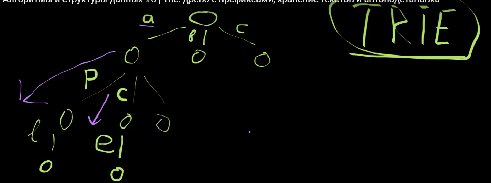

# Trie (Префиксное дерево)

Trie — это дерево, где каждый узел хранит символ, а путь от корня к листу формирует строку. <u>В отличие от обычных деревьев, у каждого узла может быть произвольное количество потомков</u>, что позволяет эффективно хранить строки с общими префиксами.

## Характеристики

| Характеристика                     | Trie (Префиксное дерево)                                                                                                                                                                                |
|------------------------------------|---------------------------------------------------------------------------------------------------------------------------------------------------------------------------------------------------------|
| **Принцип работы**                 | Узлы дерева представляют символы строк. Путь от корня к узлу формирует строку. У каждого узла может быть произвольное количество потомков, что позволяет эффективно хранить строки с общими префиксами. |
| **Преимущества**                   | Быстрый поиск и вставка строк за *O(m)*, где *m* — длина строки. Экономия памяти за счет хранения общих префиксов один раз.                                                                             |
| **Недостатки**                     | Высокий расход памяти для строк без общих префиксов. Сложность реализации.                                                                                                                              |
| **Основные операции**              | - `insert` (вставка): *O(m)*,  - `search` (поиск): *O(m)*,  - `delete` (удаление): *O(m)*,  - `starts_with` (поиск по префиксу): *O(m)*                                                     |
| **Типичные применения**            | Автозаполнение, словари, проверка орфографии, поиск по префиксам, маршрутизация URL.                                                                                                                    |
| **Специфические характеристики**   | Поддержка произвольного числа потомков у узлов. Возможность хранения дополнительных данных, например, частоты использования строки.                                                                     |

### Почему *O(m)* — это не *O(1)* и не *O(n)*?

В Trie сложность операций составляет *O(m)*, где *m* — это длина строки или префикса.
- Это не *O(1)*, потому что операции требуют обхода всех символов строки, а не фиксированного времени.
- И это не *O(n)*, где *n* — общее количество строк, так как время выполнения операции зависит только от длины конкретной строки, а не от общего числа строк в дереве.

