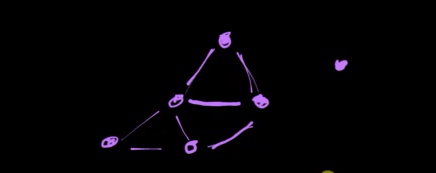

| Характеристика                     | Граф (Graph)                                                                                                                                                                                                                                                                                              |
|------------------------------------|-----------------------------------------------------------------------------------------------------------------------------------------------------------------------------------------------------------------------------------------------------------------------------------------------------------|
| **Принцип работы**                 | Граф состоит из вершин (узлов) и ребер, соединяющих эти вершины. Ребра могут быть направленными (ориентированный граф) или ненаправленными (неориентированный граф), а также могут иметь веса.                                                                                                            |
| **Преимущества**                   | Гибкость в представлении сложных структур, таких как социальные сети, транспортные сети и схемы связей. Поддержка как направленных, так и ненаправленных связей между элементами.                                                                                                                         |
| **Недостатки**                     | Высокая сложность реализации и поиска оптимальных решений в больших графах. Возможны циклы, которые усложняют алгоритмы обработки.                                                                                                                                                                        |
| **Основные операции**              | - `add_vertex` (добавление вершины): *O(1)*,<br/> - `add_edge` (добавление ребра): *O(1)*,<br/> - `remove_vertex` (удаление вершины): *O(V + E)*,<br/> - `remove_edge` (удаление ребра): *O(1)*,<br/> - `search` (поиск): *O(V + E)* для DFS/BFS, *O(E log V)* для Dijkstra's, где V - колво вершин, E колво ребер |
| **Типичные применения**            | Социальные сети, карты, маршрутизация, моделирование сетей, анализ зависимостей, задачи оптимизации, теория игр.                                                                                                                                                                                          |
| **Специфические характеристики**   | Поддержка как ориентированных, так и неориентированных связей. Возможность задания весов на ребрах. Различные виды графов, такие как ациклические графы, деревья, полные графы.                                                                                                                           |

  
Граф может быть
- **ЗАЦЫКЛЕННЫМ**, т.е.иметь связь к елменту на одном уровне, т.е. к соседнему ноду
- нод может быть СИРИТОЙ,т.е. не иметь свзяи с остальными нодами

| Характеристика             | Граф (Graph)                                                                                           | Дерево (Tree)                                                                                           |
|----------------------------|--------------------------------------------------------------------------------------------------------|----------------------------------------------------------------------------------------------------------|
| **Структура**              | Состоит из вершин и ребер, связи могут быть произвольными.                                              | Иерархическая структура с вершинами и ребрами, связи строго организованы.                                 |
| **Циклы**                  | Может содержать циклы, где можно вернуться к начальной вершине.                                         | Не содержит циклов; каждый узел связан с другими узлами единственным путем.                               |
| **Корень**                 | Нет фиксированного корня, любой узел может быть начальной точкой.                                       | Имеет один корневой узел, от которого идут все связи.                                                     |
| **Сортировка вершин**      | Вершины могут быть произвольно упорядочены.                                                             | Вершины организованы иерархически: корень, потомки, листья.                                               |
| **Связи (ребра)**          | Может иметь направленные или ненаправленные, взвешенные или невзвешенные ребра.                         | Связи всегда направлены от родителя к потомку, без циклов.                                                |
| **Применение**             | Социальные сети, карты, сетевые маршруты, анализ зависимостей.                                          | Иерархии, файловые системы, структуры данных, базовые алгоритмы поиска и сортировки.                      |

Терминология:
- узлы/ноды --> **вершины** (от англ - <u>vertex</u>)
- связи/линцки,линии --> **ребра** (от англ - <u>edge</u>)
- **смежные вершины** (от англ - <u>adjacent vertices</u>) --> вершины к которым мы можем перейти ЗА ОДИН ШАГ  

### dfs - Depth-first search - в глубину


### Breadth-First Search  - в ширину


### Графы с весами
пример станции, то Вопрос - "как мне лучше всего выбрать путь из пункта А в пункт Б?"


---------------

# Алгоритм Дейкстры: Пример с Графом

В этом примере мы рассмотрим, как работает алгоритм Дейкстры для нахождения кратчайшего пути от вершины `A` до вершины `E` в ориентированном графе с неотрицательными весами рёбер.

## Граф

Мы имеем следующий граф, где вершины соединены рёбрами с указанными весами:

```
      5
  A ----> B
  |       |
 8|       |6
  |       |
  v       v
  D ----> C
   \     ^
   4\   /9
     v /
      E
```

## Таблица Шагов Алгоритма

Алгоритм Дейкстры работает, последовательно обновляя кратчайшие известные расстояния до каждой вершины и используя эту информацию для улучшения оценок путей до других вершин.

1. **Начало с вершины A:**
   - В начальный момент времени расстояние от `A` до самой себя равно `0`, а до всех остальных вершин оно установлено в бесконечность.
   - Вершина `A` становится текущей вершиной.
   
2. **Обновление соседей вершины A:**
   - Для `B`: новое расстояние через `A` составляет `0 + 5 = 5`.
   - Для `D`: новое расстояние через `A` составляет `0 + 8 = 8`.

   Таблица обновляется следующим образом:
   ```
   Вершина   | A | B | D | C | E |
   Расстояние| 0 | 5 | 8 | ∞ | ∞ |
   Предыдущая| - | A | A | - | - |
   ```

3. **Выбор следующей вершины:**
   - Выбираем вершину с минимальным расстоянием, которая еще не обработана. Это вершина `B` с расстоянием `5`.
   - Вершина `B` становится текущей вершиной.

4. **Обновление соседей вершины B:**
   - Для `C`: новое расстояние через `B` составляет `5 + 6 = 11`.
   - Для `D`: новое расстояние через `B` составляет `5 + 9 = 14` (но оно больше текущего известного расстояния до `D`, так что не обновляем его).

   Таблица обновляется следующим образом:
   ```
   Вершина   | A | B | D | C | E |
   Расстояние| 0 | 5 | 8 | 11| ∞ |
   Предыдущая| - | A | A | B | - |
   ```

5. **Выбор следующей вершины:**
   - Следующей вершиной становится `D`, так как у нее наименьшее расстояние среди необработанных вершин (8).

6. **Обновление соседей вершины D:**
   - Для `C`: новое расстояние через `D` составляет `8 + 3 = 11` (но оно совпадает с текущим известным расстоянием до `C`, так что не обновляем его).
   - Для `E`: новое расстояние через `D` составляет `8 + 4 = 12`.

   Таблица обновляется следующим образом:
   ```
   Вершина   | A | B | D | C | E |
   Расстояние| 0 | 5 | 8 | 11| 12|
   Предыдущая| - | A | A | D | D |
   ```

7. **Выбор следующей вершины:**
   - Следующей вершиной становится `C`, так как у нее наименьшее расстояние среди необработанных вершин (11).

8. **Завершение:**
   - Вершина `E` теперь также обработана, и алгоритм завершает работу.

## Итоговый Кратчайший Путь

Из итоговой таблицы видно, что кратчайший путь от `A` до `E` проходит через `D` и `C`, и его длина составляет `12`.

Путь: `A -> D -> E`  
Длина пути: `12`


