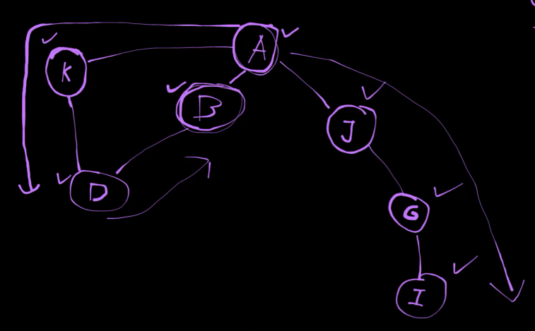

| Характеристика                     | Граф (Graph)                                                                                                                                                                                        |
|------------------------------------|-----------------------------------------------------------------------------------------------------------------------------------------------------------------------------------------------------|
| **Принцип работы**                 | Граф состоит из вершин (узлов) и ребер, соединяющих эти вершины. Ребра могут быть направленными (ориентированный граф) или ненаправленными (неориентированный граф), а также могут иметь веса.     |
| **Преимущества**                   | Гибкость в представлении сложных структур, таких как социальные сети, транспортные сети и схемы связей. Поддержка как направленных, так и ненаправленных связей между элементами.                  |
| **Недостатки**                     | Высокая сложность реализации и поиска оптимальных решений в больших графах. Возможны циклы, которые усложняют алгоритмы обработки.                                                                   |
| **Основные операции**              | - `add_vertex` (добавление вершины): *O(1)*,  - `add_edge` (добавление ребра): *O(1)*,  - `remove_vertex` (удаление вершины): *O(V + E)*,  - `remove_edge` (удаление ребра): *O(1)*,  - `search` (поиск): *O(V + E)* для DFS/BFS, *O(E log V)* для Dijkstra |
| **Типичные применения**            | Социальные сети, карты, маршрутизация, моделирование сетей, анализ зависимостей, задачи оптимизации, теория игр.                                                                                     |
| **Специфические характеристики**   | Поддержка как ориентированных, так и неориентированных связей. Возможность задания весов на ребрах. Различные виды графов, такие как ациклические графы, деревья, полные графы.                        |

  
Граф может быть
- **ЗАЦЫКЛЕННЫМ**, т.е.иметь связь к елменту на одном уровне, т.е. к соседнему ноду
- нод может быть СИРИТОЙ,т.е. не иметь свзяи с остальными нодами

| Характеристика             | Граф (Graph)                                                                                           | Дерево (Tree)                                                                                           |
|----------------------------|--------------------------------------------------------------------------------------------------------|----------------------------------------------------------------------------------------------------------|
| **Структура**              | Состоит из вершин и ребер, связи могут быть произвольными.                                              | Иерархическая структура с вершинами и ребрами, связи строго организованы.                                 |
| **Циклы**                  | Может содержать циклы, где можно вернуться к начальной вершине.                                         | Не содержит циклов; каждый узел связан с другими узлами единственным путем.                               |
| **Корень**                 | Нет фиксированного корня, любой узел может быть начальной точкой.                                       | Имеет один корневой узел, от которого идут все связи.                                                     |
| **Сортировка вершин**      | Вершины могут быть произвольно упорядочены.                                                             | Вершины организованы иерархически: корень, потомки, листья.                                               |
| **Связи (ребра)**          | Может иметь направленные или ненаправленные, взвешенные или невзвешенные ребра.                         | Связи всегда направлены от родителя к потомку, без циклов.                                                |
| **Применение**             | Социальные сети, карты, сетевые маршруты, анализ зависимостей.                                          | Иерархии, файловые системы, структуры данных, базовые алгоритмы поиска и сортировки.                      |

Терминология:
- узлы/ноды --> **вершины** (от англ - <u>vertex</u>)
- связи/линцки,линии --> **ребра** (от англ - <u>edge</u>)
- **смежные вершины** (от англ - <u>adjacent vertices</u>) --> вершины к которым мы можем перейти ЗА ОДИН ШАГ  

### dfs

