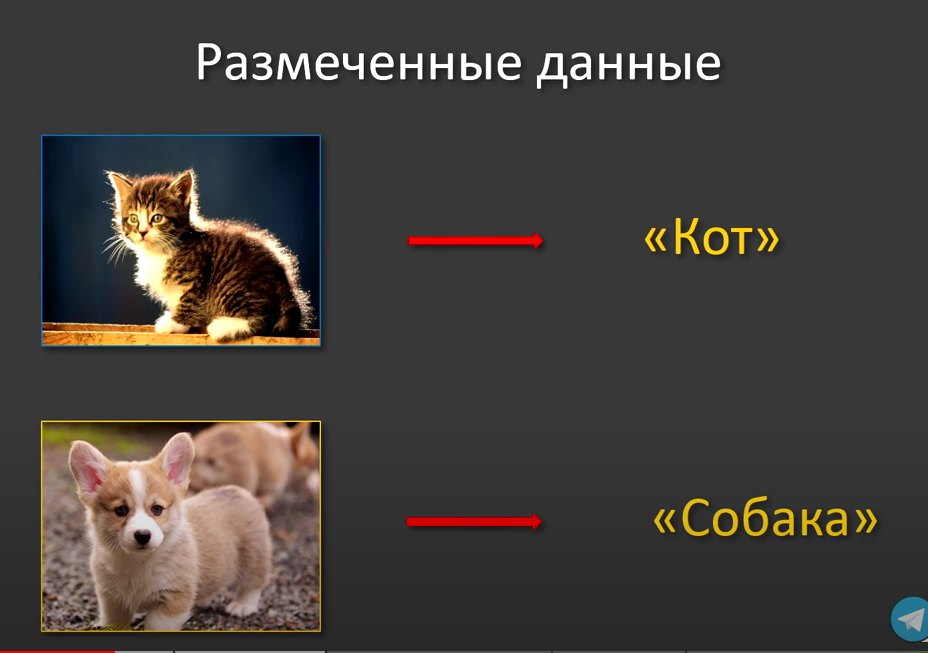
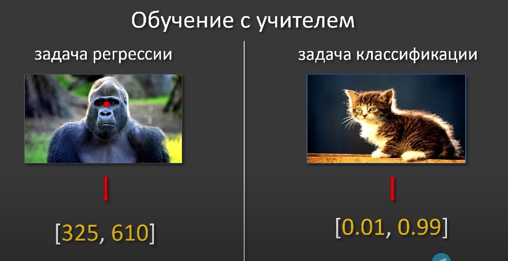
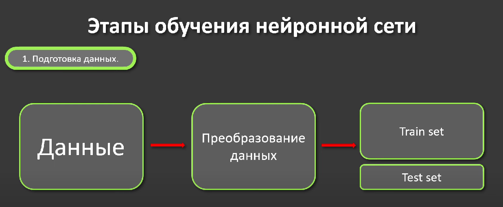
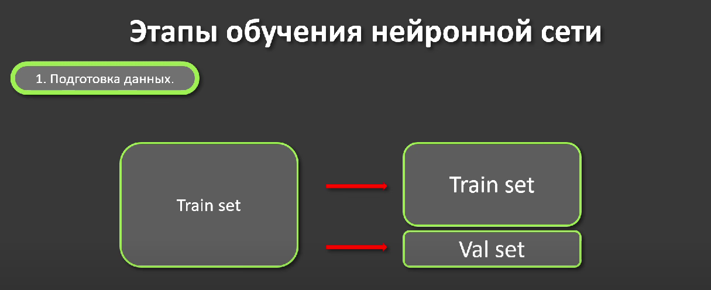
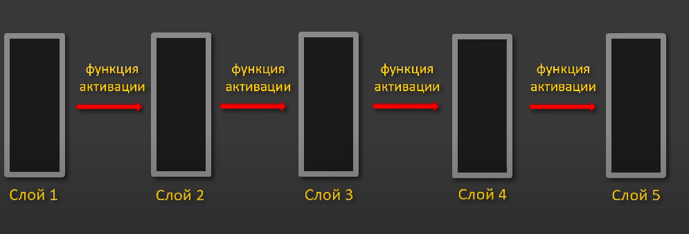
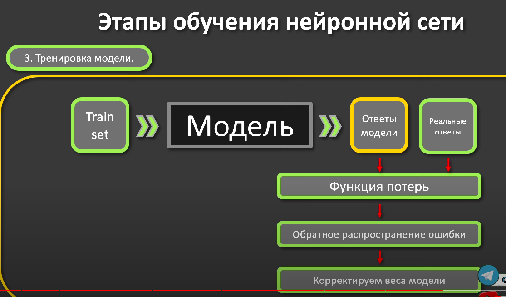
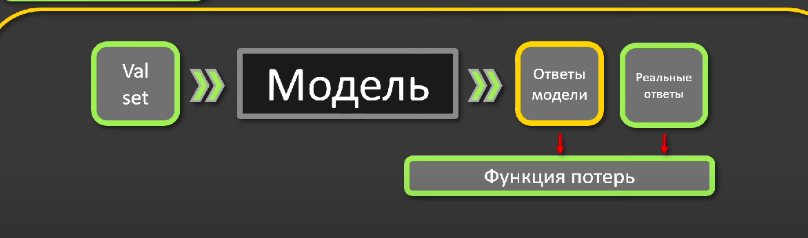

## Существют 3 вида обучений

## что пройдем в курсе

### обучение с учителей - єто когда для данных подготовлен набор ответ(РАЗМЕЧЕННЫЕ ДАННЫЕ)

# Обучение с учителем (Supervised Learning)

Обучение с учителем — это один из методов машинного обучения, при котором модель обучается на основе предварительно
размеченных данных. Этот процесс включает следующие шаги:

- **Набор данных**: Используются данные, где каждому входу соответствует известный ответ (например, фотографии животных
  с метками их видов).
- **Обучение**: Модель учится предсказывать ответы, анализируя входные данные и соответствующие им метки.
- **Тестирование**: После обучения модель тестируется на новых данных, чтобы проверить её способность к обобщению.

Цель обучения с учителем — разработать модель, способную точно предсказывать метки для новых, ранее не виденных данных.

### от качеста разметки зависит результат обучения нейронной сети

## Класификация данных

---

# Задачи обучения с учителем

## Регрессия

- **Описание**: Предсказывает непрерывные значения (например, координаты [325, 610] на изображении гориллы).

## Классификация

- **Описание**: Относит объекты к категориям (например, вероятность того, что объект — кот, выраженная
  как [0.01(собака), 0.99(кот)]).

---

# Этапы обучения нейронной сети

## 1. Подготовка данных

- **Данные**: Исходные данные собираются для обучения.
- **Преобразование данных**: Данные преобразуются (например, нормализация) для эффективного обучения.
- **Train set и Test set**: Данные разделяются на обучающий набор (train set) для тренировки модели и тестовый набор (
  test set) для оценки её эффективности.

### теперь забываем про Test set и переходим к Train set, которая в свою очередь делиться на

- **Train set (Обучающий набор)**: Используется для тренировки модели.
- **Val set (Валидационный набор)**: Используется для настройки параметров и предотвращения переобучения, позволяя
  оценить модель во время обучения.

## 2. Построение модели

- **Модель**: Структура нейронной сети состоит из последовательности слоев.
- **Слои**: Данные проходят через несколько слоев (Слой 1, Слой 2, ... Слой 5), где каждый слой преобразует информацию
  для выявления полезных признаков.
- **Выход**: В конце модель выдает ответы, основанные на обучении от входных данных до желаемых выходных данных.

### Функции активации

- **Описание**: После каждого слоя в модели следует функция активации, которая помогает ввести нелинейность в процесс
  обработки данных.
- **Роль**: Функции активации позволяют сети учиться на сложных данных, делая возможным обучение на задачах, которые не
  могут быть решены простым линейным классификатором.
- **Примеры**: Сигмоид, ReLU (Rectified Linear Unit), Tanh и другие.

### Функция потерь

- **Описание**: Функция потерь измеряет разницу между предсказаниями модели и реальными данными.
- **Роль**: Оценивает точность модели во время обучения, помогая оптимизировать параметры для минимизации ошибок.
- **Примеры**: Среднеквадратичная ошибка (MSE) для регрессии, кросс-энтропия для классификации.

#### За что отвечает метод оптимизации?

- **Минимизация ошибки**: Цель — найти такие параметры модели, при которых функция потерь будет иметь минимальное
  значение.
- **Сходимость**: Обеспечивает, чтобы процесс обучения сходился, то есть чтобы модель достигла состояния, в котором
  дальнейшие изменения весов мало влияют на ошибку.
- **Преодоление локальных минимумов**: Некоторые расширенные методы оптимизации помогают избежать застревания в
  локальных минимумах функции потерь, стремясь найти глобальный минимум.

# Этап 3. Тренировка модели

## Тренировка модели

- **Описание**: Модель обучается на обучающем наборе данных (Train set), где она учится определять закономерности и
  делать предсказания.
- **Процесс**: Во время тренировки модель постоянно корректирует свои внутренние параметры (веса) на основе ошибок,
  определенных функцией потерь и минимизированных методом оптимизации.

### Этапы тренировки модели

1. **Подача данных**: Обучающий набор данных (Train set) подается на вход модели.
2. **Предсказание**: Модель обрабатывает данные и выдает предсказания (Ответы модели).
3. **Сравнение с реальными ответами**: Предсказания модели сравниваются с реальными ответами.
4. **Вычисление ошибки**: Функция потерь оценивает разницу между предсказаниями и реальными ответами.
5. **Обратное распространение ошибки**: Ошибка используется для вычисления градиентов каждого параметра модели.
    - **Просто**: Это метод вычисления, как сильно каждый параметр модели (вес) влияет на ошибку. По сути, это помогает
      понять, нужно ли увеличивать или уменьшать веса, чтобы модель лучше работала.
6. **Корректировка весов**: Оптимизатор адаптирует веса модели в зависимости от вычисленных градиентов, чтобы
   минимизировать ошибку.
    - **Просто**: После того как мы знаем, как веса влияют на ошибку, оптимизатор (например, SGD или Adam) изменяет веса
      в таком направлении, чтобы ошибка уменьшилась. Если вес увеличивает ошибку, он уменьшается, а если уменьшает —
      увеличивается.

### Цель

- Целью тренировки модели является улучшение ее способности точно предсказывать реальные ответы, минимизируя ошибку
  предсказания на каждом шаге тренировки.

## Валидация модели

- **Описание**: Валидация модели происходит на валидационном наборе данных (Val set), который используется для проверки
  эффективности модели.
- **Цель**: Проверить, как модель будет работать на новых данных, и обеспечить, чтобы она не переобучилась на обучающем
  наборе.

На схеме показан процесс валидации модели, который включает следующие шаги:

1. **Валидационный набор (Val set)**:
    - Данные, не используемые в тренировке, подаются в модель для оценки ее производительности.

2. **Модель**:
    - Обрабатывает валидационные данные и выдает предсказания.

3. **Ответы модели**:
    - Предсказания, сделанные моделью на основе валидационного набора данных.

4. **Реальные ответы**:
    - Истинные значения, соответствующие валидационному набору.

5. **Функция потерь**:
    - Сравнивает ответы модели и реальные ответы, вычисляя степень ошибки или потерь.

Этот процесс позволяет оценить, насколько хорошо модель способна обобщать на новых данных, что является критически
важным для проверки ее эффективности в реальных условиях. Модель в процессе обучения может находиться в одном из трех
состояний:

### 1. Обучается (Learning)

- **Описание**: Модель успешно усваивает закономерности из обучающего набора данных и улучшает свою способность к
  предсказанию.
- **Признаки**: Уменьшение ошибки на тренировочном наборе данных и стабильные результаты на валидационном наборе.

### 2. Не обучается (Not Learning)

- **Описание**: Модель не улучшает свои предсказания, несмотря на обучение.
- **Признаки**: Нет изменений или ухудшение производительности модели на обучающих и валидационных данных, что может
  быть вызвано недостаточной сложностью модели, недостатком данных или неправильной настройкой параметров.

### 3. Переобучается (Overfitting)

- **Описание**: Модель слишком хорошо усваивает детали тренировочного набора данных, включая шум, что ведет к плохой
  обобщающей способности на новых данных.
- **Признаки**: Низкая ошибка на тренировочных данных и высокая ошибка на валидационных данных, указывающая на то, что
  модель слишком специализирована на тренировочных примерах.

Эти состояния позволяют оценить, насколько эффективно модель может быть использована для решения реальных задач, и
указывают на возможные направления для корректировки процесса обучения.

# Этап 4. Тестирование модели

После обучения и валидации модели, следующим важным этапом является тестирование.

## На тренировочных данных

- **Цель**: Обучение модели, то есть подстройка весов и параметров на основе известных примеров и их результатов.
- **Процесс**: Модель "учится" предсказывать результаты, минимизируя ошибку между предсказаниями и реальными значениями.

## На валидационных данных

- **Цель**: Оптимизация гиперпараметров и проверка обобщающей способности модели без переобучения.
- **Процесс**: Модель проверяется на данных, которые не использовались в процессе обучения, чтобы убедиться, что модель
  не только запоминает тренировочные данные, но и способна работать с новыми, невидимыми ранее данными.

## На тестовых данных

- **Цель**: Окончательная проверка производительности модели перед её использованием в реальных условиях.
- **Процесс**: Модель тестируется на новом наборе данных, который не использовался во время обучения или валидации,
  чтобы имитировать реальное применение и оценить, как модель будет работать на данных, которые она никогда ранее не
  видела.

Таким образом, каждый этап использует данные различным образом, чтобы поэтапно подтвердить способность модели к
обучению, обобщению и окончательному применению в реальных условиях.

