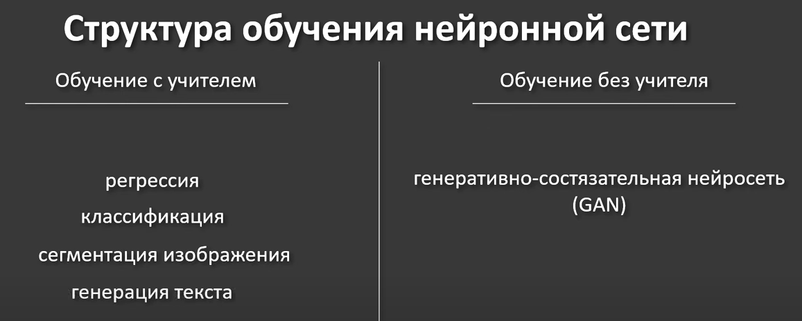
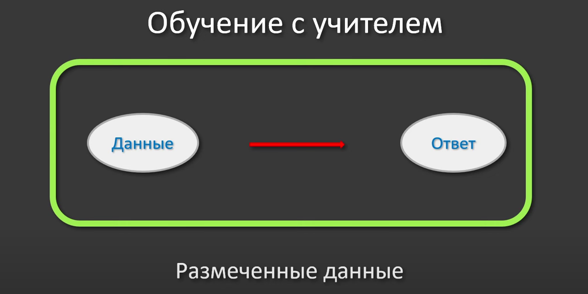
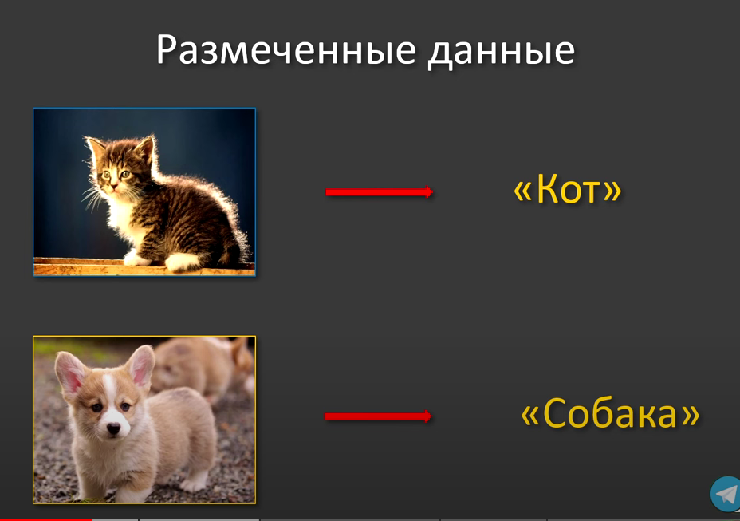

## Существют 3 вида обучений

## что пройдем в курсе

### обучение с учителей - єто когда для данных подготовлен набор ответ(РАЗМЕЧЕННЫЕ ДАННЫЕ)

### от качеста разметки зависит результат обучения нейронной сети

## Класификация данных

