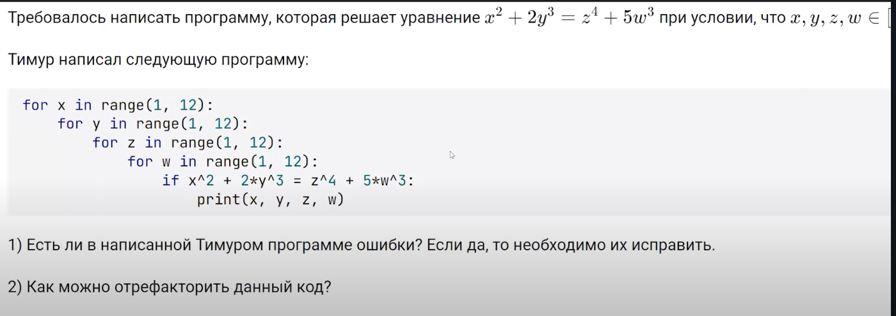

# Требуется найти решения уравнения: x^2 + 2y^3 = z^4 + 5w^3
# при условии, что x, y, z, w ∈ [1, 12]




# Проходим по всем возможным значениям x, y, z, w от 1 до 12
```python
for x in range(1, 13):  # диапазон должен включать 12, поэтому до 13
    for y in range(1, 13):
        for z in range(1, 13):
            for w in range(1, 13):
                # Проверяем уравнение
                if x**2 + 2*y**3 == z**4 + 5*w**3:
                    # Выводим решения
                    print(x, y, z, w)
```

#  Refactor code

```python
from itertools import product

# Используем product для генерации всех комбинаций x, y, z, w
for x, y, z, w in product(range(1, 13), repeat=4):
    # Проверяем уравнение
    if x**2 + 2*y**3 == z**4 + 5*w**3:
        # Выводим решения
        print(x, y, z, w)
```


