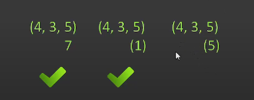
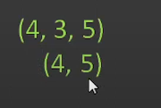

- в правую ось будет автоматически добавленна НУЛВЕАЯ ОСЬ
- На крайней ось уже ОДНИКОВАЕ кол-во елментов,т.е. второе правило выполняется, на осях
    - либо одинковое кол-во лементов(в нашем случае на 1ой)
    - либо ОДИН лемент(в нашем случае на 0ой)

Сейчас они уже согласованы, а значит можно проводить любые мат операции

----

Еще пару примеров

- массив любого размера всегда может согласован с числом
- массив любого размера всегда может согласован с массивом ИЗ ОДНОГО ЕЛЕМЕНТА
- по второму правилу, нумпай автоматиески добавить две оси слева
    - 

----

- неогласованный массив
    - 
- но можно не слева добавить оси, а справа(оставив 4ку слева)
    - 

----

- неогласованный массив
    - 
- можно сденлать согласованным, добавив ось посредине
    - 