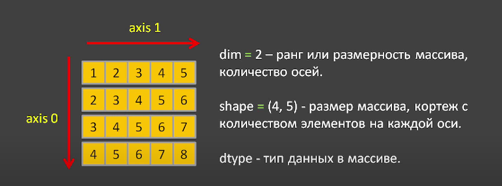
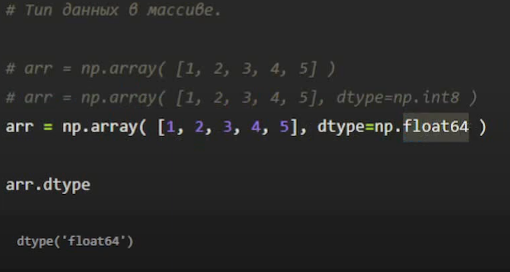

# Описание двумерного массива



На изображении представлен двумерный массив с основными характеристиками:

- **Оси (Axis)**:
    - `Axis 0`: Вертикальное направление, 4 элемента (строки).
    - `Axis 1`: Горизонтальное направление, 5 элементов (столбцы).

- **Размерность (Dimension)**:
    - `dim = 2`: Указывает на то, что массив является двумерным.

- **Форма (Shape)**:
    - `shape = (4, 5)`: Массив содержит 4 строки и 5 столбцов.

- **Тип данных (dtype)**:
    - Массив должен содержать элементы одного и того же типа данных, что повышает эффективность обработки и снижает
      потребление памяти.

### Важно:

В массивах NumPy все элементы должны иметь один и тот же тип данных, что обеспечивает оптимальное использование памяти и
производительность вычислений.


---

# Примеры массивов в NumPy

Импортируем библиотеку NumPy:

```python
import numpy as np
```

## Одномерный массив

Создаем одномерный массив из последовательности чисел от 0 до 9:

```python
np.arange(10)
```

**Вывод:**

```
array([0, 1, 2, 3, 4, 5, 6, 7, 8, 9])
```

## Двумерный массив

Создаем двумерный массив с формой (4, 5) из последовательности чисел от 0 до 19:

```python
np.arange(20).reshape(4, 5)
```

**Вывод:**

```
array([[ 0,  1,  2,  3,  4],
       [ 5,  6,  7,  8,  9],
       [10, 11, 12, 13, 14],
       [15, 16, 17, 18, 19]])
```

## Трехмерный массив

Создаем трехмерный массив с формой (3, 2, 2) из последовательности чисел от 0 до 11:

```python
np.arange(12).reshape(3, 2, 2)
```

**Вывод:**

```
array([[[ 0,  1],
        [ 2,  3]],

       [[ 4,  5],
        [ 6,  7]],

       [[ 8,  9],
        [10, 11]]])
```

## Четырехмерный массив

Создаем четырехмерный массив с формой (3, 3, 2, 2) из последовательности чисел от 0 до 35:

```python
np.arange(36).reshape(3, 3, 2, 2)
```

**Вывод:**

```
array([[[[ 0,  1],
         [ 2,  3]],

        [[ 4,  5],
         [ 6,  7]],

        [[ 8,  9],
         [10, 11]]],


       [[[12, 13],
         [14, 15]],

        [[16, 17],
         [18, 19]],

        [[20, 21],
         [22, 23]]],


       [[[24, 25],
         [26, 27]],

        [[28, 29],
         [30, 31]],

        [[32, 33],
         [34, 35]]]])
```

---

## При создании массива можно указывать тип зхначений

