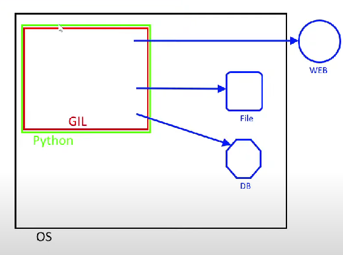

# Разница между I/O-bound и CPU-bound задачами

На изображении показана работа Python с ограничением GIL, а также с операциями ввода-вывода и вычислениями. Разберём, как эти задачи различаются в контексте многопоточности и работы с GIL.

## I/O-bound задачи

**I/O-bound задачи** — это задачи, которые зависят от ввода/вывода (сетевые запросы, чтение/запись файлов, взаимодействие с базой данных и т.д.). Основная характеристика таких задач в том, что они большую часть времени **ожидают** завершения операций. Процессор почти не используется, и поэтому **многопоточность** может эффективно использоваться для параллельной обработки нескольких I/O задач.



- На изображении задачи, такие как запросы в веб (WEB), работа с файлами (File) или базами данных (DB), показаны снаружи GIL.
- GIL не блокирует выполнение этих операций, потому что они выполняются вне Python-интерпретатора (например, сетевые или файловые операции).
- Потоки могут переключаться между ожиданием завершения операций и выполнением других задач.

### Пример I/O-bound задачи

```python
import threading
import time
import requests

def activity():
    requests.get("https://www.google.com/")  # Ожидание завершения запроса (I/O-bound)

def run(threaded=False):
    start = time.time()
    if not threaded:
        for e in range(10):
            activity()
    else:
        threads = [threading.Thread(target=activity, daemon=True) for _ in range(10)]
        for e in threads:
            e.start()
        for e in threads:
            e.join()

    end = time.time()
    print(f'Time: {end - start} seconds')

if __name__ == '__main__':
    run(threaded=True)
```

### Как это работает:
- В данном примере функция `activity()` выполняет I/O-bound задачу (веб-запрос). 
- При запуске нескольких потоков с `threaded=True`, потоки не блокируются GIL, так как основное время уходит на ожидание ответа от сервера.

## CPU-bound задачи

**CPU-bound задачи** — это задачи, которые требуют большого количества вычислительных ресурсов. Эти задачи активно используют процессор, выполняя сложные расчеты. В Python такие задачи **ограничиваются GIL**, поскольку потоки не могут выполнять Python-байткод одновременно на нескольких ядрах.

- На изображении Python с GIL ограничивает выполнение многопоточных вычислительных задач.
- Все вычисления происходят внутри Python, и GIL не позволяет эффективно распределять работу между потоками.
- В итоге, для задач с высокой нагрузкой на процессор (CPU-bound) многопоточность в Python работает неэффективно.

### Пример CPU-bound задачи

```python
import threading
import time

def activity():
    for e in range(1000_000):
        abs(round(e * 2 / 122) + e * 3.14)  # Интенсивные вычисления (CPU-bound)

def run(threaded=False):
    start = time.time()
    if not threaded:
        for e in range(10):
            activity()
    else:
        threads = [threading.Thread(target=activity, daemon=True) for _ in range(10)]
        for e in threads:
            e.start()
        for e in threads:
            e.join()

    end = time.time()
    print(f'Time: {end - start} seconds')

if __name__ == '__main__':
    run(threaded=True)
```

### Как это работает:
- В этом примере функция `activity()` выполняет интенсивные вычисления, загружая процессор.
- При использовании многопоточности (с `threaded=True`), несмотря на наличие нескольких потоков, все они будут ограничены GIL, что приведет к тому, что время выполнения почти не сократится по сравнению с однопоточным выполнением.

## Заключение

- **I/O-bound задачи** выигрывают от использования потоков в Python, так как время выполнения связано с ожиданием завершения операций ввода-вывода, а не с процессорными вычислениями. GIL не ограничивает такие операции.
- **CPU-bound задачи** сильно ограничены GIL. Потоки не могут выполнять вычисления параллельно, что делает многопоточность неэффективной для таких задач.
- Для **I/O-bound задач** можно использовать многопоточность, а для **CPU-bound задач** лучше применять многопроцессорную модель (модуль `multiprocessing`).


---

`NumPy and Pandas` работают точно также - у них основная логика написана на С и она лежит отдельно от пайтона-GIL