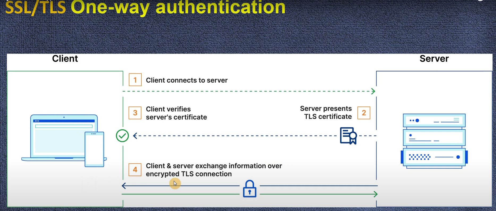
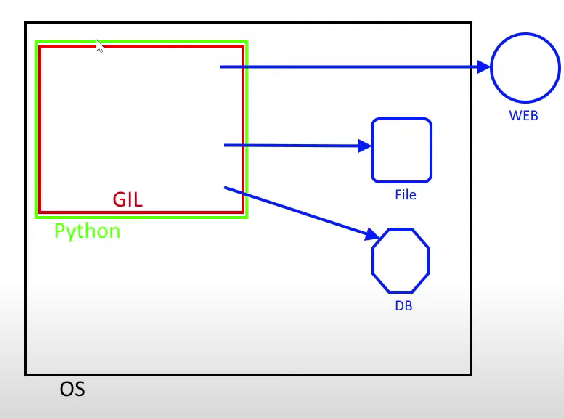

# VPC, Subnets, Instances, Security Groups, Auto Scaling, and Load Balancer Explained

## Введение в архитектуру VPC

VPC (Virtual Private Cloud) - это виртуальная сеть, в которой находятся ресурсы, такие как инстансы (виртуальные
машины), сабнеты, Security Groups и другие компоненты. В этой сети организовано взаимодействие и безопасность для всех
элементов.

### Как инстансы взаимодействуют с сабнетами и Security Groups?

- **VPC и Сабнеты:**
    - Представь, что у тебя есть дом (VPC), и у этого дома есть комнаты (сабнеты). В каждой комнате могут жить разные
      члены семьи (инстансы), и все они живут в одном доме.
    - В VPC у тебя могут быть разные сабнеты: например, один сабнет для веб-серверов (Public Subnet), а другой для баз
      данных (Private Subnet).
    - Обычно одна подсеть соответствует одной зоне доступности (Availability Zone). Зона доступности — это отдельная
      физическая локация в регионе AWS, что обеспечивает высокую доступность и отказоустойчивость ресурсов. Каждая
      подсеть связана с одной конкретной зоной доступности, что позволяет распределять ресурсы и обеспечить их изоляцию
      от сбоев в других зонах. физически расположены в одной зоне
      доступности, что позволяет использовать преимущества высокой доступности и устойчивости.
    - CIDR - каждая подсеть может иметь свой список ДИАПАЗОН АЙПИ адрессов работающих в сети

- **Инстансы внутри Сабнетов:**
    - В каждом сабнете находятся инстансы — виртуальные машины, которые выполняют разные задачи. Например, веб-серверы в
      одном сабнете обрабатывают входящий трафик пользователей, а база данных в другом сабнете отвечает на запросы
      веб-серверов.

- **Общение между инстансами:**
    - Инстансы внутри одного сабнета могут общаться напрямую, если это разрешено правилами безопасности (например,
      правила в Security Group и Network ACL).
    - Например, веб-сервер должен подключиться к базе данных, Security Group на инстансе базы данных должна разрешать
      доступ от веб-сервера. Это позволяет им безопасно взаимодействовать.

---

## Auto Scaling и Load Balancer: Совместная Работа

### Совместная Работа

- **Auto Scaling** отвечает за увеличение и уменьшение количества инстансов в зависимости от нагрузки и состояния
  системы.
- **Load Balancer** отвечает за равномерное распределение входящего трафика между инстансами и обеспечивает
  отказоустойчивость.

#### Задачи, Которые Решают Load Balancer и Auto Scaling Вместе:

- **Масштабирование системы** для повышения производительности.
- **Обеспечение отказоустойчивости** и автоматического восстановления после сбоев.
- **Оптимизация затрат** на ресурсы при изменении нагрузки.

----

### Типы Архитектур

1. **Монолитная Архитектура:**
    - Все компоненты (например, веб-сервер, база данных) находятся в одном приложении.
    - 

2. **Микросервисная Архитектура:**
    - Приложение делится на множество небольших сервисов, которые взаимодействуют друг с другом.
    - 

3. **Серверлесс Архитектура:**
    - Используются функции без необходимости управления серверной инфраструктурой.
    - 

4. **Архитектура с Балансировщиком Нагрузки и Автоскейлингом:**
    - Включает балансировщик нагрузки и автоматическое масштабирование для обработки большого количества трафика.
    - 

## Заключение

Таким образом, VPC обеспечивает виртуальную сеть, в которой могут работать различные инстансы. Сабнеты делят сеть на
сегменты, инстансы выполняют свои задачи внутри этих сегментов, а Security Groups обеспечивают их безопасность.
Балансировщики нагрузки и автоскейлинг обеспечивают устойчивость и масштабируемость системы.
---

# CIDR и Security Groups

## Как это работает:

**CIDR** (например, 10.0.0.0/16, 10.0.1.0/24, 10.0.2.0/24): позволяет вам определять диапазоны IP-адресов для каждой
части вашей сети, например, для создания подсетей внутри VPC.

**Security Group**: контролирует, какие типы трафика разрешены или запрещены для каждого инстанса. Например, Security
Group для Инстанса A позволяет любому компьютеру подключаться по HTTP, а доступ по SSH разрешает только для конкретного
IP-адреса.

## Пример:

Представьте, что ваш офис — это сеть, а рабочие столы в офисе — это отдельные IP-адреса. **CIDR-блок 10.0.0.0/16**
задает "размер" вашего офиса, в котором может быть много рабочих столов (IP-адресов).

Таким образом, каждый компьютер или устройство в вашей сети получает IP-адрес из диапазона, определенного этим
CIDR-блоком.

**Security Group** в этом примере действует как охрана на входе в офис: она решает, кто может зайти (подключиться) и что
им разрешено делать (какие порты открыты).

---

# Internet Gateway, NAT Gateway, and API Gateway in AWS

## Основные отличия

1. **Internet Gateway и NAT Gateway** — это сетевые компоненты, обеспечивающие доступ к Интернету для ресурсов в VPC:
    - **Internet Gateway** предоставляет доступ к Интернету для публичных подсетей.
    - **NAT Gateway** предоставляет доступ к Интернету для приватных подсетей, но блокирует входящий трафик.

2. **API Gateway** — это уровень управления API, который позволяет взаимодействовать с backend-сервисами(Lambda, EC2,
   или другим API) по HTTP/HTTPS
   протоколу. Это совсем другой уровень абстракции, используемый для построения API и управления запросами к backend, а
   не для сетевого подключения ресурсов.

## Пример использования

- **Internet Gateway** используется для того, чтобы сервер веб-приложения мог быть доступен в Интернете.
- **NAT Gateway** используется, чтобы база данных могла загружать обновления с Интернета, не будучи доступной извне.
- **API Gateway** используется для управления запросами пользователей к веб-сервису, например, к API, который выполняет
  бизнес-логику.

## В контексте VPC

- **Internet Gateway** и **NAT Gateway** являются частью VPC для управления сетевым доступом к ресурсам.
- **API Gateway** управляет HTTP-запросами и связывает клиентов с сервисами, которые могут находиться как внутри VPC,
  так и за её пределами.
