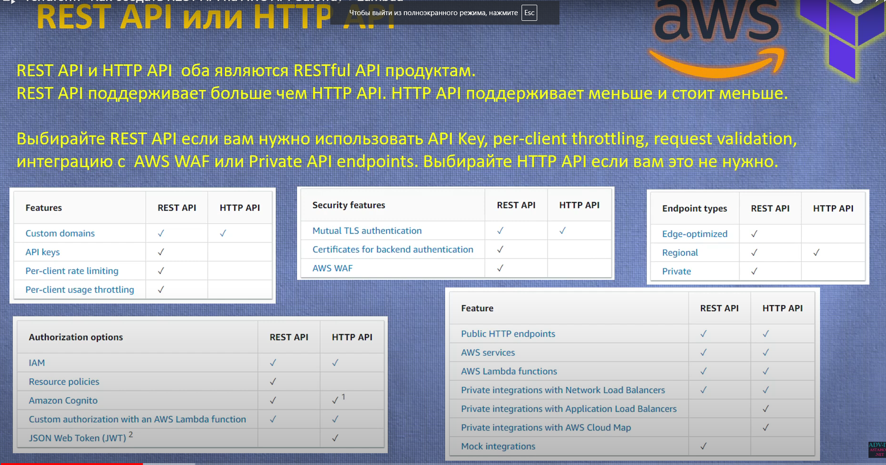

# Сравнение REST API и HTTP API

REST API и HTTP API оба являются RESTful API продуктами.
REST API поддерживает больше чем HTTP API. HTTP API поддерживает меньше и стоит меньше.

## Выбор API

Выбирайте **REST API**, если вам нужно использовать API Key, per-client throttling, request validation, интеграцию с AWS
WAF или Private API endpoints. Выбирайте **HTTP API**, если вам это не нужно.

## Особенности

| Features                    | REST API | HTTP API | Описание                                             |
|-----------------------------|:--------:|:--------:|------------------------------------------------------|
| Custom domains              |    ✔️    |    ✔️    | Поддержка пользовательских доменов для вашего API.   |
| API keys                    |    ✔️    |    ✔️    | Использование ключей API для контроля доступа.       |
| Per-client rate limiting    |    ✔️    |          | Ограничение количества запросов для каждого клиента. |
| Per-client usage throttling |    ✔️    |          | Регулирование скорости запросов для каждого клиента. |

## Безопасность

| Security features                       | REST API | HTTP API | Описание                                                          |
|-----------------------------------------|:--------:|:--------:|-------------------------------------------------------------------|
| Mutual TLS authentication               |          |    ✔️    | Двусторонняя TLS аутентификация для повышения безопасности.       |
| Certificates for backend authentication |    ✔️    |          | Использование сертификатов для аутентификации серверных запросов. |
| AWS WAF                                 |    ✔️    |          | Интеграция с AWS Web Application Firewall для защиты API.         |

## Типы конечных точек

| Endpoint types | REST API | HTTP API | Описание                                                           |
|----------------|:--------:|:--------:|--------------------------------------------------------------------|
| Edge-optimized |    ✔️    |          | Оптимизация для глобального распределения с минимальной задержкой. |
| Regional       |    ✔️    |    ✔️    | Региональное размещение API для уменьшения задержек.               |
| Private        |    ✔️    |    ✔️    | Приватные API, доступные только внутри вашей VPC.                  |

## Дополнительные функции

| Feature                                              | REST API | HTTP API | Описание                                                                      |
|------------------------------------------------------|:--------:|:--------:|-------------------------------------------------------------------------------|
| Public HTTP endpoints                                |    ✔️    |    ✔️    | Открытые конечные точки HTTP для общедоступного API.                          |
| AWS services                                         |    ✔️    |    ✔️    | Интеграция с различными AWS сервисами.                                        |
| AWS Lambda functions                                 |    ✔️    |    ✔️    | Поддержка интеграции с AWS Lambda для выполнения кода.                        |
| Private integrations with  Network Load Balancers    |    ✔️    |    ✔️    | Приватные интеграции с сетевыми балансировщиками нагрузки.                    |
| Private integrations with Application Load Balancers |          |    ✔️    | Приватные интеграции с балансировщиками нагрузки приложений.                  |
| Private integrations with AWS Cloud Map              |          |    ✔️    | Приватные интеграции с AWS Cloud Map для управления ресурсами.                |
| Mock integrations                                    |    ✔️    |          | Моделирование интеграций для тестирования API без реальных серверных вызовов. |

## Опции авторизации

| Authorization options                            | REST API | HTTP API | Описание                                                                           |
|--------------------------------------------------|:--------:|:--------:|------------------------------------------------------------------------------------|
| IAM                                              |    ✔️    |    ✔️    | Использование IAM для управления доступом к API.                                   |
| Resource policies                                |    ✔️    |    ✔️    | Политики ресурсов для управления доступом на уровне ресурсов.                      |
| Amazon Cognito                                   |    ✔️    |    ✔️    | Использование Amazon Cognito для управления пользовательскими сессиями и доступом. |
| Custom authorization with an AWS Lambda function |    ✔️    |    ✔️    | Пользовательская авторизация через Lambda функцию для дополнительной логики.       |
| JSON Web Token (JWT) 2                           |          |    ✔️    | Поддержка JWT для авторизации и передачи данных пользователя.                      |
