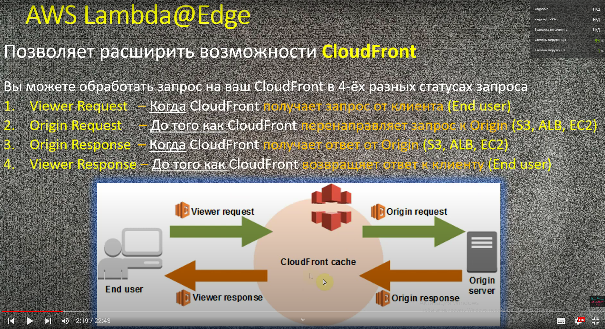
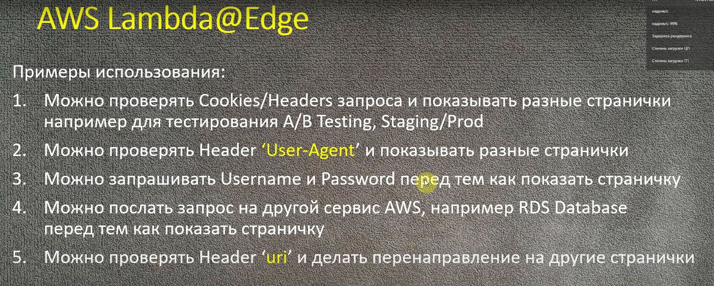
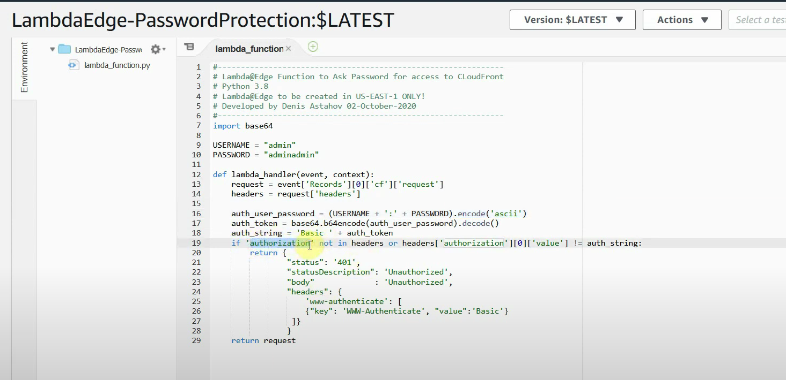

## lambda edge - расширения для сервиса CloudFront

## Можно обрабатывать в 4х позициях(статусах запроса)

### т.е. можно лямбду функцию поставить на одну из єтих позций(или сразу на всех 4х(на любой стадии добавить лямбду))

